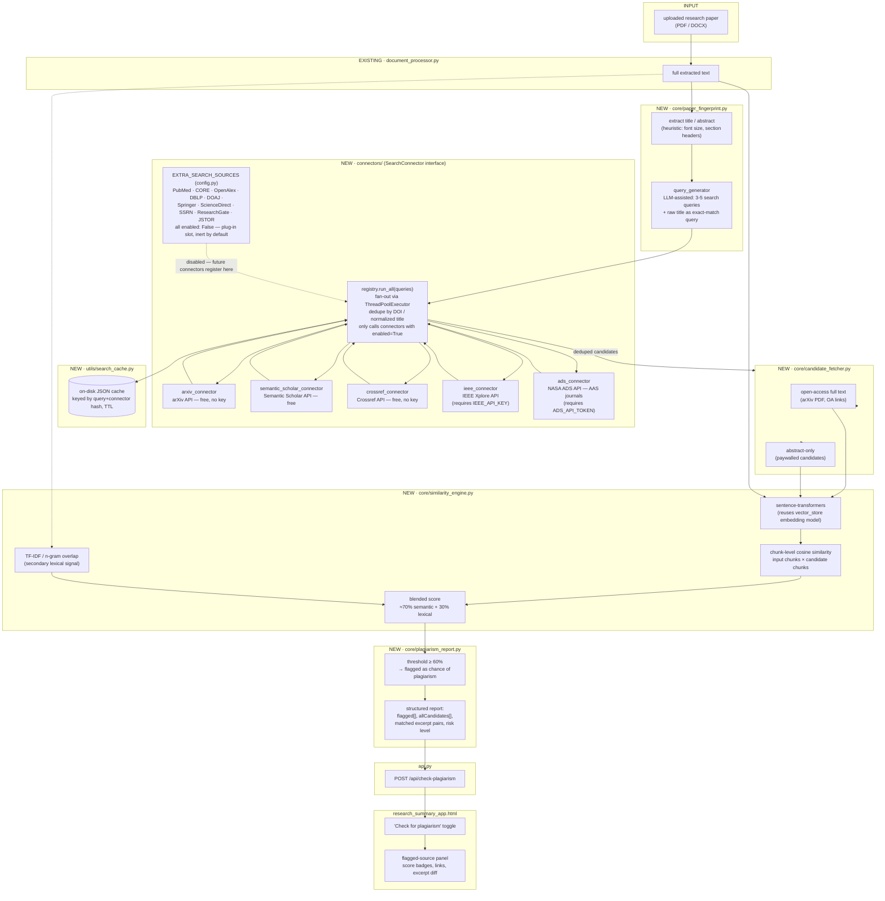
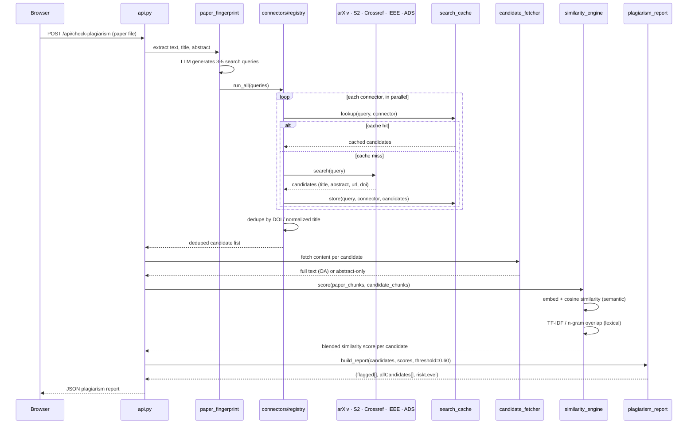

# Similarity Finder — Architecture

Plagiarism/originality check for uploaded research papers. Extends
ResearchMind (currently a fully-local pipeline) with a new stage that
searches external academic sources and flags **≥60% content similarity**
as a **chance of plagiarism**.

> **Local vs. external:** every other stage of ResearchMind runs fully
> offline. This feature is the one exception — it must reach external
> search APIs over the network. It is designed as an isolated, opt-in
> pipeline stage so the rest of the app stays local-only.

## Source coverage decision

Google Scholar and the ACM Digital Library have no official public
search API. Rather than scrape them (fragile, against ToS), this design
uses **official/free APIs only**, per the hybrid approach:

| Requested source | Connector used | Why |
|---|---|---|
| Google Scholar | *(not implemented)* | No public API; SerpAPI would be the only reliable path, out of scope for the official-API-only approach. Known coverage gap. |
| IEEE site | `ieee_connector.py` — IEEE Xplore API | Official API, free developer key, metadata + abstracts. |
| ACM site | *(not implemented directly)* | No public ACM DL API. Covered indirectly — Crossref and Semantic Scholar both index ACM-published papers (title/abstract/DOI). |
| AAS site | `ads_connector.py` — NASA ADS API | AAS journals (ApJ, AJ, ApJL) are canonically indexed by NASA's Astrophysics Data System, which has a free, official API — the correct on-topic source for "AAS site". |
| general web / broad coverage | `arxiv_connector.py`, `semantic_scholar_connector.py`, `crossref_connector.py` | All free, keyless or low-friction, and together give broad cross-publisher coverage (including most IEEE/ACM/AAS metadata as a fallback). |

## Placeholder for additional sources (not yet exposed)

The connector layer is a plug-in registry, not a fixed list of five.
`config.py` carries an `EXTRA_SEARCH_SOURCES` placeholder dict for
databases nobody has wired up yet — each entry is inert until a
matching connector file is dropped into `connectors/` and its
`enabled` flag is flipped on. This is where a future source (something
requested later, an institutional subscription, a niche domain
database) gets added without touching the registry's fan-out logic.

```python
# config.py — placeholder registry. Entries are metadata only; adding
# a source here does nothing until a connectors/<key>_connector.py
# implementing SearchConnector exists AND "enabled" is set to True.
EXTRA_SEARCH_SOURCES = {
    "pubmed":        {"name": "PubMed / NCBI E-utilities",       "base_url": "https://eutils.ncbi.nlm.nih.gov/entrez/eutils/",          "api_key_env": None,                "access": "official_api",  "enabled": False},
    "core":          {"name": "CORE (core.ac.uk)",               "base_url": "https://api.core.ac.uk/v3/search/works/",                "api_key_env": "CORE_API_KEY",      "access": "official_api",  "enabled": False},
    "openalex":      {"name": "OpenAlex",                        "base_url": "https://api.openalex.org/works",                         "api_key_env": None,                "access": "official_api",  "enabled": False},
    "dblp":          {"name": "DBLP (CS bibliography)",          "base_url": "https://dblp.org/search/publ/api",                       "api_key_env": None,                "access": "official_api",  "enabled": False},
    "doaj":          {"name": "DOAJ (Directory of OA Journals)", "base_url": "https://doaj.org/api/search/articles/",                  "api_key_env": None,                "access": "official_api",  "enabled": False},
    "springer":      {"name": "Springer Link",                   "base_url": "https://api.springernature.com/meta/v2/",                "api_key_env": "SPRINGER_API_KEY",  "access": "official_api",  "enabled": False},
    "sciencedirect": {"name": "Elsevier ScienceDirect",          "base_url": "https://api.elsevier.com/content/search/sciencedirect",  "api_key_env": "ELSEVIER_API_KEY",  "access": "official_api",  "enabled": False},
    "ssrn":          {"name": "SSRN",                             "base_url": "https://papers.ssrn.com/sol3/",                          "api_key_env": None,                "access": "scrape_only",   "enabled": False},
    "researchgate":  {"name": "ResearchGate",                     "base_url": "https://www.researchgate.net/search",                    "api_key_env": None,                "access": "scrape_only",   "enabled": False},
    "jstor":         {"name": "JSTOR",                            "base_url": "https://www.jstor.org/action/doBasicSearch",             "api_key_env": None,                "access": "scrape_only",   "enabled": False},
    # Add further sites here — key, name, base_url, api_key_env (or
    # None), access ("official_api" | "scrape_only" | "unknown"), and
    # enabled (leave False until a connector + review exists).
}
```

`access` marks how the site could be reached at all: `official_api`
sources are safe to wire up the same way IEEE/ADS are; `scrape_only`
sources have no public API — enabling those would repeat the
Google-Scholar/ACM ToS problem, so they need an explicit decision
before implementation, not just a flag flip.

A matching connector is a small, fixed shape:

```python
# connectors/_template_connector.py — copy this to add a new source.
from connectors.base import SearchConnector, CandidatePaper

class TemplateConnector(SearchConnector):
    source_key = "pubmed"          # must match an EXTRA_SEARCH_SOURCES key

    def search(self, query: str, max_results: int = 10) -> list[CandidatePaper]:
        # call config.EXTRA_SEARCH_SOURCES[self.source_key]["base_url"],
        # map the response into CandidatePaper(title, authors, abstract,
        # url, source, year, doi) and return the list.
        raise NotImplementedError
```

`registry.py` discovers connectors by `source_key` and only calls
`.search()` on ones marked `enabled: True` in `EXTRA_SEARCH_SOURCES` —
so adding a row to the dict above is a documentation/roadmap step, and
dropping in the connector file plus flipping `enabled` is the actual
activation step.

## Component architecture



## Request sequence



## New modules introduced

| Module | Responsibility |
|---|---|
| `core/paper_fingerprint.py` | Extract title/abstract, generate search queries via LLM |
| `connectors/base.py` | `SearchConnector` interface: `search(query, max_results) -> list[CandidatePaper]` |
| `connectors/arxiv_connector.py` | arXiv API — free, keyless |
| `connectors/semantic_scholar_connector.py` | Semantic Scholar Academic Graph API — free |
| `connectors/crossref_connector.py` | Crossref API — free, keyless, cross-publisher metadata |
| `connectors/ieee_connector.py` | IEEE Xplore API — requires `IEEE_API_KEY` |
| `connectors/ads_connector.py` | NASA ADS API (AAS journals) — requires `ADS_API_TOKEN` |
| `connectors/_template_connector.py` | Copy-paste starting point for wiring up an `EXTRA_SEARCH_SOURCES` entry |
| `connectors/registry.py` | Fan-out search across enabled connectors, dedupe candidates |
| `utils/search_cache.py` | On-disk TTL cache to limit redundant/rate-limited external calls |
| `core/candidate_fetcher.py` | Resolve full text (open access) or fall back to abstract |
| `core/similarity_engine.py` | Chunk-level embedding similarity + lexical overlap, blended score |
| `core/plagiarism_report.py` | Apply 60% threshold, build the structured report |

## Config additions (`config.py`)

```python
PLAGIARISM_SIMILARITY_THRESHOLD = 0.60   # ≥ this → flagged
SIMILARITY_SEMANTIC_WEIGHT      = 0.70
SIMILARITY_LEXICAL_WEIGHT       = 0.30
SEARCH_MAX_RESULTS_PER_SOURCE   = 10
SEARCH_TIMEOUT_SEC              = 15
SEARCH_CACHE_DIR                = BASE_DIR / "search_cache"
SEARCH_CACHE_TTL_HOURS          = 168     # 1 week

IEEE_API_KEY           = os.getenv("IEEE_API_KEY", "")
ADS_API_TOKEN          = os.getenv("ADS_API_TOKEN", "")
SEMANTIC_SCHOLAR_API_KEY = os.getenv("SEMANTIC_SCHOLAR_API_KEY", "")  # optional, raises rate limit
```

IEEE and ADS connectors are skipped automatically (with a log warning)
when their key/token isn't configured — the feature still works with
arXiv + Semantic Scholar + Crossref alone.

## Known limitations

- **No Google Scholar coverage** — no official API exists; would require
  SerpAPI (paid, third-party) or scraping (against ToS). Flagged as a
  gap rather than silently worked around.
- **No direct ACM Digital Library connector** — covered indirectly via
  Crossref/Semantic Scholar metadata, which does not include ACM's
  full text.
- **Abstract-only scoring for paywalled candidates** biases the
  similarity score toward abstract/introduction overlap rather than
  full-body text — reported per-candidate via `contentLevel`.
- **`EXTRA_SEARCH_SOURCES` entries are placeholders, not live
  connectors** — PubMed, CORE, OpenAlex, DBLP, DOAJ, Springer,
  ScienceDirect, SSRN, ResearchGate, and JSTOR are listed for future
  wiring but return nothing until a connector is implemented and
  `enabled` is set to `True`. `scrape_only` entries additionally need
  an explicit ToS/feasibility decision before implementation.
