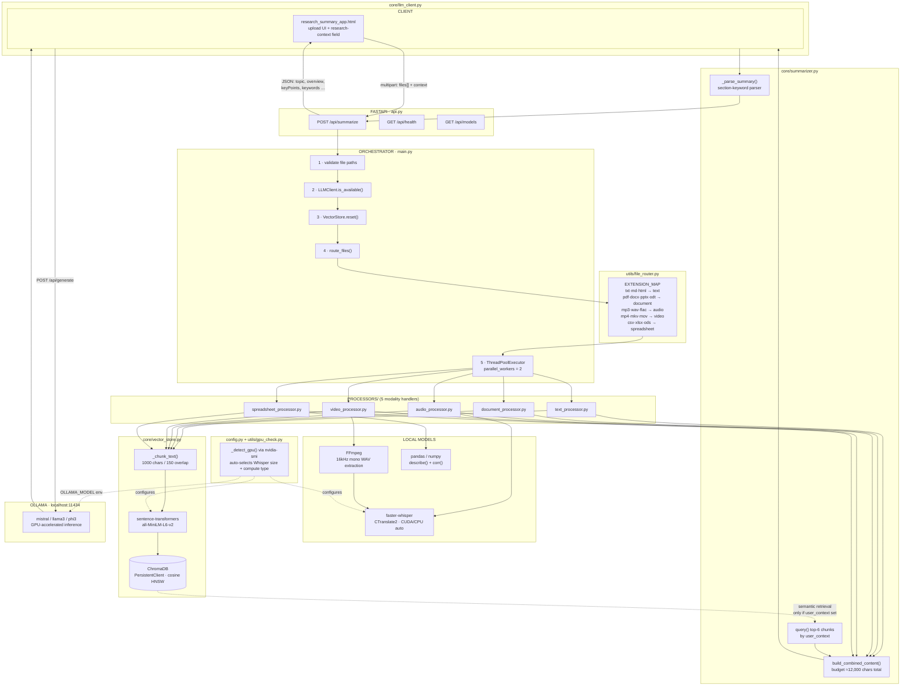
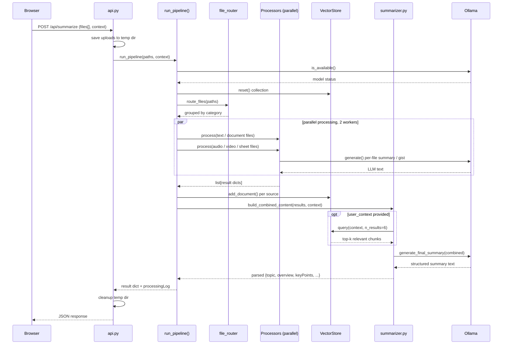

# ResearchMind — System Architecture

Local multimodal RAG pipeline: ingests text, documents, audio, video and
spreadsheets, embeds them into ChromaDB, and synthesizes a structured
research summary through a local Ollama LLM — no external API calls
for the core Summarize flow. (The Similarity Finder is the one
exception — see `similarity-finder-architecture.md`.)

## Full pipeline

## Request sequence

## Compute placement

| Component | GPU | Mechanism | Fallback |
|---|---|---|---|
| Ollama LLM | yes | Detects NVIDIA automatically | CPU inference (slower) |
| faster-whisper (ASR) | yes | CTranslate2 CUDA backend | CPU, int8 compute type |
| sentence-transformers | yes, verified | Real encode() probe before committing to CUDA | CPU if the probe fails |
| ChromaDB | no | Vector ops fast enough on CPU | — |
| pandas / numpy | no | CPU-only statistical analysis | optional cuDF for scale |
