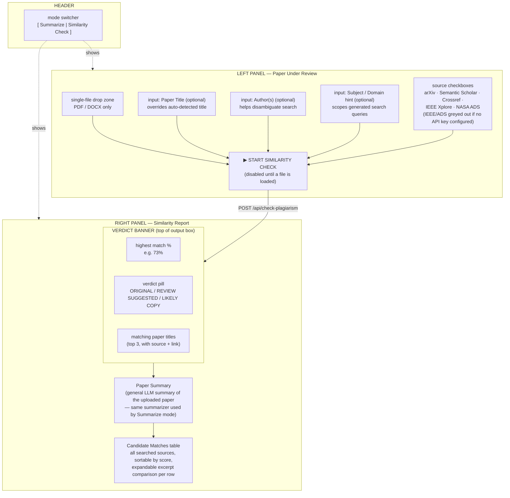
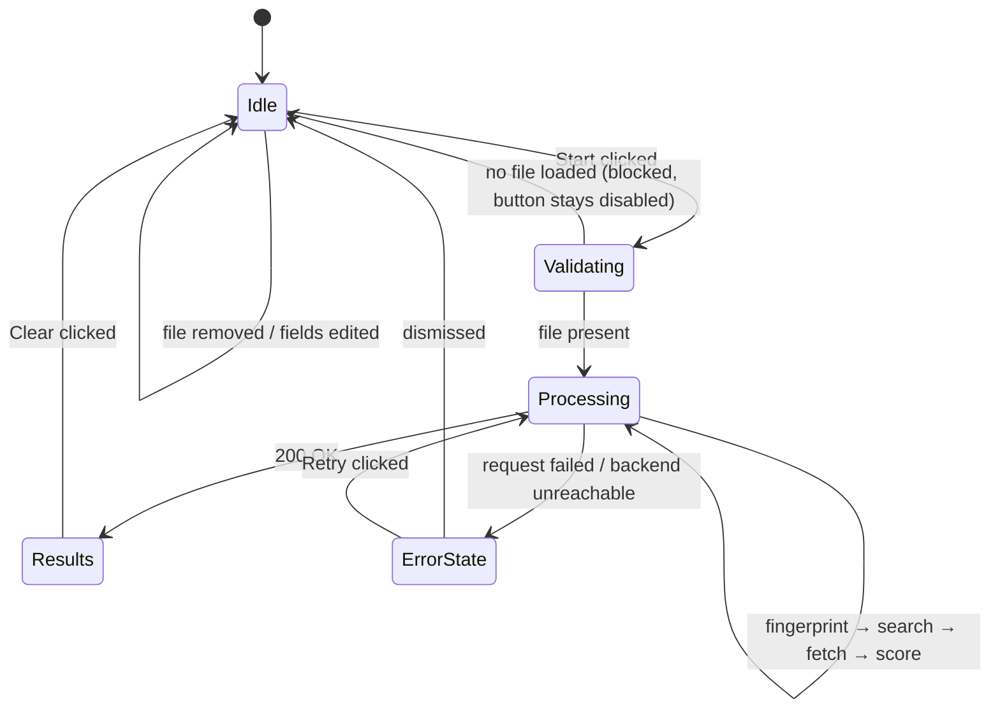
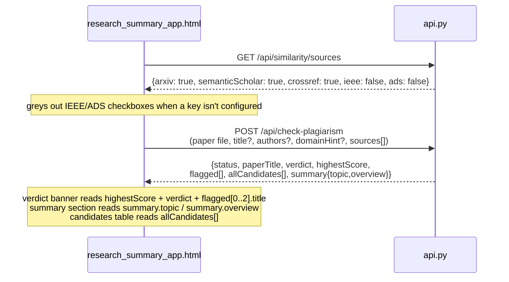

# Similarity Finder — WebUI Architecture

Extends `research_summary_app.html` with a second mode alongside the
existing "Summarize" view, rather than a separate page — same shell,
same dark theme (`--bg #0d0f14`, `--accent #e8c547`, fonts Syne / DM
Mono / Lora), so it reads as one app, not a bolted-on tool.

## Layout

A segmented mode switcher in the header swaps the main grid between
**Summarize** (existing) and **Similarity Check** (new). The new mode
keeps the established left-input / right-output two-panel pattern.

## UI states

## Verdict thresholds shown in the banner

| Highest match score | Pill | Color |
|---|---|---|
| < 40% | `ORIGINAL` | success green |
| 40–59% | `LOW OVERLAP — LIKELY ORIGINAL` | accent2 blue |
| 60–79% | `REVIEW SUGGESTED — POSSIBLE PLAGIARISM` | amber |
| ≥ 80% | `LIKELY COPY — HIGH SIMILARITY` | danger red |

The 60% line matches `PLAGIARISM_SIMILARITY_THRESHOLD` in `config.py` —
the banner surfaces the same number the backend uses to flag a
candidate, it doesn't invent a separate UI-side threshold.

## Request/response contract with the backend

## New frontend pieces in `research_summary_app.html`

| Element | Purpose |
|---|---|
| `#modeSwitch` | Toggles `.mode-summarize` / `.mode-similarity` sections |
| `#paperDropZone`, `#paperFileInput` | Single-file input for the paper under review |
| `#paperTitleInput`, `#paperAuthorInput`, `#paperDomainInput` | Optional override fields feeding query generation |
| `#sourceChecklist` | Checkboxes populated from `GET /api/similarity/sources` |
| `#startSimilarityBtn` | Disabled until a file is loaded; triggers `runSimilarityCheck()` |
| `#verdictBanner` | Top-of-output block: score, pill, matching titles |
| `#similaritySummary` | General paper summary section |
| `#candidatesTable` | Full candidate list with per-row expand for excerpt comparison |

This reuses the existing `classifyFile`, `formatSize`, `showToast`,
and toast/loading-state CSS rather than duplicating them — the new
mode is additive to the same script, not a separate file.
